<p align="center">
  
</p>

<p align="center">
  <strong>从传感器到三维交互，把真实世界信号变成可以理解、可以使用的系统。</strong>
</p>

<p align="center">
  <a href="#-project-constellation">Project Map</a> ·
  <a href="#-featured-builds">Featured Builds</a> ·
  <a href="#-engineering-stack">Engineering Stack</a> ·
  <a href="./CONTRIBUTING.md">Add a Repository</a>
</p>

<p align="center">
  
  
  
  
</p>

## 👋 About me

我是 Vic，关注软硬件结合的智能交互系统。我的工作通常跨越完整链路：传感器与 EEG 信号采集、嵌入式固件、通信协议、桌面端数据处理，以及 Three.js / MuJoCo 三维反馈。

<table>
  <tr>
    <td width="33%" align="center"><strong>80 ch</strong><br><sub>tactile sensing</sub></td>
    <td width="33%" align="center"><strong>100 Hz</strong><br><sub>real-time telemetry</sub></td>
    <td width="33%" align="center"><strong>BLE + Serial</strong><br><sub>device connectivity</sub></td>
  </tr>
</table>

```text
SENSORS / EEG  ──▶  EMBEDDED ACQUISITION  ──▶  DATA PIPELINE  ──▶  3D INTERACTION
```

## 🚀 Featured builds

<table>
  <tr>
    <td width="50%" valign="top">
      <h3>🧠 <a href="https://github.com/Sunnymark7/SSVEP-3dhand">SSVEP-3dhand</a></h3>
      <p>浏览器端 SSVEP 三维手部交互演示。支持左右手镜像、骨骼调试、单指动画以及五频视觉刺激块。</p>
      <p><code>Three.js</code> <code>WebGL</code> <code>JavaScript</code> <code>BCI</code></p>
      <a href="https://github.com/Sunnymark7/SSVEP-3dhand"><strong>Explore project →</strong></a>
    </td>
    <td width="50%" valign="top">
      <h3>⚡ <a href="https://github.com/Sunnymark7/esp_downloadtool">esp_downloadtool</a></h3>
      <p>面向 ESP32 固件包的一键下载工具。自动识别固件文件、烧录地址和串口，并提供分阶段进度反馈。</p>
      <p><code>Python</code> <code>PyQt</code> <code>esptool</code> <code>ESP32</code></p>
      <a href="https://github.com/Sunnymark7/esp_downloadtool"><strong>Explore project →</strong></a>
    </td>
  </tr>
</table>

## 🛰 Project constellation

下面的内容由 GitHub Actions 自动生成。新仓库会根据 `project-*` Topic 或名称、描述和技术关键词自动进入对应项目组。

<!-- AUTO-PROJECTS:START -->
<!-- Generated by scripts/update_projects.py; do not edit this block manually. -->

<p align="center">
  
  
  
</p>

### 🖐️ eHand · 智能触觉手套　`project-ehand`

> 多通道触觉、手部姿态、嵌入式通信与实时三维反馈。

🔒 **Private R&D** · 2 repositories

### 🧠 Neurotech · 脑机交互　`project-neurotech`

> SSVEP、EEG 采集、手部控制与神经交互实验。

| Repository | Purpose | Technology | Updated |
| --- | --- | --- | --- |
| [**SSVEP-3dhand**](https://github.com/Sunnymark7/SSVEP-3dhand) | Browser-based SSVEP 3D hand interaction demo with Three.js and WebGL | `HTML` `bci` `ssvep` `threejs` | `2026-08` |

🔒 **Private R&D** · 1 repository

### ⚡ Embedded · 嵌入式工具　`project-embedded`

> ESP32 固件、烧录工具、ADC 与设备侧数据采集。

| Repository | Purpose | Technology | Updated |
| --- | --- | --- | --- |
| [**esp_downloadtool**](https://github.com/Sunnymark7/esp_downloadtool) | One-click ESP32 firmware flashing tool with automatic package and serial-port detection | `Python` `esp32` `firmware` `flashing-tool` | `2026-08` |

🔒 **Private R&D** · 1 repository

### 🧪 Instrumentation · 科研测量　`project-instrumentation`

> 标定、测量和实验仪器配套软件。

🔒 **Private R&D** · 1 repository

### 📐 Simulation · 工程仿真　`project-simulation`

> 动力学、机械振动、模型与工程计算。

🔒 **Private R&D** · 1 repository

### 🧩 Experiments · 创意原型　`project-experiments`

> 独立网页实验、快速验证和轻量交互原型。

🔒 **Private R&D** · 2 repositories

<sub>自动同步公开仓库；私有仓库只显示数量，不公开名称和链接。</sub>

<!-- AUTO-PROJECTS:END -->

## 🧰 Engineering stack

| Layer | Technologies |
| --- | --- |
| **Sensing** | Pressure arrays · IMU · EEG · High-resolution ADC |
| **Embedded** | ESP32-S3 · PlatformIO · C / C++ · BLE · Serial |
| **Desktop** | Python · PyQt · Real-time charts · Calibration tools |
| **Simulation** | MuJoCo · Dynamics · Sensor-to-model mapping |
| **Web & 3D** | Three.js · WebGL · JavaScript · Interactive prototypes |

<details>
  <summary><strong>⚙️ 主页如何自动整理仓库？</strong></summary>
  <br>
  <ol>
    <li>为新仓库添加一个 Topic，例如 <code>project-ehand</code> 或 <code>project-embedded</code>。</li>
    <li><a href="https://github.com/Sunnymark7/Sunnymark7/actions/workflows/sync-profile.yml">Sync profile projects</a> 每天自动运行，也可手动运行。</li>
    <li>脚本读取仓库 Topics、描述、语言和更新时间，重新生成上面的 Project constellation。</li>
    <li>没有 Topic 的仓库会按关键词推断；仍无法识别时会进入“待整理”区，不会丢失。</li>
  </ol>
  <p>完整的新建与归类命令见 <a href="./CONTRIBUTING.md">Add a Repository</a>。</p>
</details>

---

<p align="center">
  <i>Build the signal path. Make the invisible visible.</i><br>
  <a href="https://github.com/Sunnymark7?tab=repositories">All repositories</a> ·
  <a href="https://github.com/Sunnymark7/Sunnymark7/actions">Automation</a>
</p>
