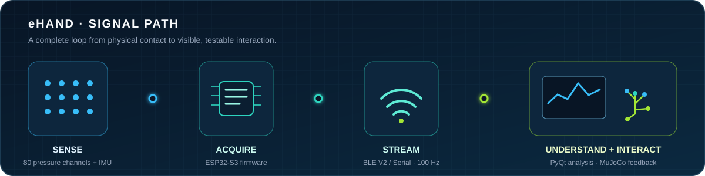
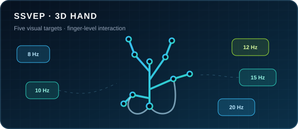
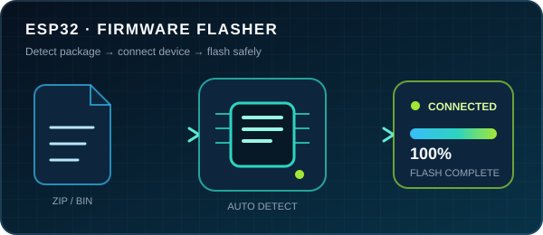

  

<h3 align="center">把真实世界的信号，做成可理解、可控制、可交互的系统。</h3>

  Vic · Intelligent Systems / Interactive Hardware 
  从传感器和 EEG，到嵌入式采集、桌面工具与三维反馈。

  <a href="#project-atlas"><strong>Explore projects</strong></a> ·
  <a href="#working-model">How I build</a> ·
  <a href="#automation">Auto organization</a> ·
  <a href="https://github.com/Sunnymark7?tab=repositories">All repositories</a>

## 🛰️ Project Atlas

每一个仓库都归入一个明确的项目族；先看系统解决什么问题，再看它用了什么技术。公开仓库由 Topic 自动发现，私有研发只展示经过筛选的安全信息。

<!-- AUTO-PROJECTS:START -->
<!-- Generated by scripts/update_projects.py; do not edit this block manually. -->

  <strong>10 organized systems</strong> · 6 project families · topic-routed &amp; auto-synced

<table>
  <tr>
    <td width="50%" valign="top">
      <h3>🖐️ eHand</h3>
      智能触觉手套
      
从 80 通道触觉与手部姿态，到实时桌面分析和 MuJoCo 三维反馈。

      
<code>2 systems</code> <code>Tactile</code> <code>ESP32-S3</code> <code>MuJoCo</code>

      <a href="#project-ehand"><strong>Explore project family →</strong></a>
    </td>
    <td width="50%" valign="top">
      <h3>🧠 Neurotech</h3>
      脑机交互
      
围绕 EEG / EMG 采集、SSVEP 识别与三维交互建立实验链路。

      
<code>2 systems</code> <code>EEG</code> <code>FBCCA</code> <code>Three.js</code>

      <a href="#project-neurotech"><strong>Explore project family →</strong></a>
    </td>
  </tr>
  <tr>
    <td width="50%" valign="top">
      <h3>⚡ Embedded</h3>
      采集与设备工具
      
覆盖高精度 ADC 采集、ESP32 固件交付和串口设备工作流。

      
<code>2 systems</code> <code>STM32</code> <code>ESP32</code> <code>Python</code>

      <a href="#project-embedded"><strong>Explore project family →</strong></a>
    </td>
    <td width="50%" valign="top">
      <h3>🌡️ Instrumentation</h3>
      科研测量
      
把仪器控制、标定算法、数据管理与报告输出组合为可复用工具。

      
<code>1 system</code> <code>.NET 8</code> <code>WPF</code> <code>ITS-90</code>

      <a href="#project-instrumentation"><strong>Explore project family →</strong></a>
    </td>
  </tr>
  <tr>
    <td width="50%" valign="top">
      <h3>📐 Simulation</h3>
      工程仿真
      
动力学、机械振动与工程计算的课程实践和验证。

      
<code>1 system</code> <code>Dynamics</code> <code>Python</code> <code>Matplotlib</code>

      <a href="#project-simulation"><strong>Explore project family →</strong></a>
    </td>
    <td width="50%" valign="top">
      <h3>◌ Project Inbox</h3>
      待归类
      
已自动发现，但还没有 project-* Topic 的公开仓库。

      
<code>2 systems</code> <code>Needs topic</code>

      <a href="#repository-inbox"><strong>Explore project family →</strong></a>
    </td>
  </tr>
  <tr>
    <td width="100%" valign="top" colspan="2">
      <h3>⚙️ Auto Routing</h3>
      仓库自动整理
      
Topic 决定项目族，工作流负责发现、排序、隐私过滤和页面更新。

      
<code>Every 6h</code> <code>Topics</code> <code>Actions</code> <code>Privacy</code>

      <a href="#automation"><strong>Add or organize a repository →</strong></a>
    </td>
  </tr>
</table>

## ✦ Engineering systems

### 🖐️ eHand · 智能触觉手套

从 80 通道触觉与手部姿态，到实时桌面分析和 MuJoCo 三维反馈。

<code>project-ehand</code> · 2 systems

  

<table>
  <tr>
    <td width="100%" valign="top">
      <strong>FLAGSHIP · PRIVATE R&amp;D</strong> · <code>ACTIVE</code>
      <h3>eHand · Intelligent Tactile Glove</h3>
      
采集 80 路压力与 IMU 姿态，完成标定、实时曲线、BLE / 串口通信和 MuJoCo 手部反馈。

      
<code>Python</code> <code>PyQt5</code> <code>MuJoCo</code>

      80 pressure channels · 100 Hz telemetry
    </td>
  </tr>
</table>

<table>
  <tr>
    <td width="100%" valign="top">
      <strong>HARDWARE · PRIVATE R&amp;D</strong> · <code>ACTIVE</code>
      <h3>eHand Hardware · ESP32-S3 Sensor Stack</h3>
      
面向触觉手套的 ESP32-S3 固件与硬件栈，整合压力矩阵、MPU6050 DMP 及 BLE V2 / 串口遥测。

      
<code>C++</code> <code>PlatformIO</code> <code>BLE</code>

      Firmware · pin map · BLE telemetry · hardware docs in progress
    </td>
  </tr>
</table>

### 🧠 Neurotech · 脑机交互

围绕 EEG / EMG 采集、SSVEP 识别与三维交互建立实验链路。

<code>project-neurotech</code> · 2 systems

<table>
  <tr>
    <td width="100%" valign="top">
      <strong>BCI · PRIVATE RESEARCH</strong> · <code>RESEARCH</code>
      <h3>NeuroControl · SSVEP Command Suite</h3>
      
实时采集 EEG / EMG，使用 FBCCA 完成 SSVEP 分类，并连接无人机、游戏与轮椅等控制实验。

      
<code>Python</code> <code>FBCCA</code> <code>Pygame</code>

      Acquisition · classification · command integration
    </td>
  </tr>
</table>

<table>
  <tr>
    <td width="100%" valign="top">
      <strong>PUBLIC PROTOTYPE</strong> · <code>PROTOTYPE</code>
      

      <h3><a href="https://github.com/Sunnymark7/SSVEP-3dhand">SSVEP 3D Hand Interaction</a></h3>
      
浏览器端三维手部实验：支持镜像、骨骼调试、单指动作与五频视觉刺激块，为后续在线 EEG 分类预留交互层。

      
<code>Three.js</code> <code>WebGL</code> <code>JavaScript</code>

      Last delivery · 2026-03
      
<a href="https://github.com/Sunnymark7/SSVEP-3dhand"><strong>View repository →</strong></a>

    </td>
  </tr>
</table>

### ⚡ Embedded · 采集与设备工具

覆盖高精度 ADC 采集、ESP32 固件交付和串口设备工作流。

<code>project-embedded</code> · 2 systems

<table>
  <tr>
    <td width="100%" valign="top">
      <strong>DAQ · PRIVATE PROTOTYPE</strong> · <code>PROTOTYPE</code>
      <h3>ADS1256 · 8-Channel Data Acquisition</h3>
      
基于 STM32F030F4 与 ADS1256 的 8 通道采集链路，支持 SPI / DMA、UART CSV 和 Web Serial 实时配置与绘图。

      
<code>Embedded C</code> <code>SPI / DMA</code> <code>Web Serial</code>

      24-bit ADC · 8 channels · browser monitor
    </td>
  </tr>
</table>

<table>
  <tr>
    <td width="100%" valign="top">
      <strong>PUBLIC TOOL</strong> · <code>ACTIVE</code>
      

      <h3><a href="https://github.com/Sunnymark7/esp_downloadtool">ESP32 Firmware Flasher</a></h3>
      
Windows 一键固件烧录工具：自动识别 ZIP 固件布局、串口与芯片，并在失败时回退波特率。

      
<code>Python</code> <code>Tkinter</code> <code>esptool</code>

      Last delivery · 2026-05
      
<a href="https://github.com/Sunnymark7/esp_downloadtool"><strong>View repository →</strong></a>

    </td>
  </tr>
</table>

### 🌡️ Instrumentation · 科研测量

把仪器控制、标定算法、数据管理与报告输出组合为可复用工具。

<code>project-instrumentation</code> · 1 system

<table>
  <tr>
    <td width="100%" valign="top">
      <strong>INSTRUMENTATION · PRIVATE R&amp;D</strong> · <code>ACTIVE</code>
      <h3>Marine Sensor Calibration Suite</h3>
      
面向海洋传感器的温度标定套件：协调温控设备，采集测温电桥与 SPRT 数据，并完成 ITS-90 多点标定与报告。

      
<code>C# / WPF</code> <code>SQLite</code> <code>GPIB / Modbus</code>

      .NET 8 · multipoint calibration · reports
    </td>
  </tr>
</table>

### 📐 Simulation · 工程仿真

动力学、机械振动与工程计算的课程实践和验证。

<code>project-simulation</code> · 1 system

<table>
  <tr>
    <td width="100%" valign="top">
      <strong>PRIVATE · COURSEWORK ADAPTATION</strong> · <code>COMPLETED</code>
      <h3>Half-Car Suspension Dynamics</h3>
      
机械振动课程中的半车悬架动力学适配；基于 nrsyed/half-car（GPL-3.0），补充中文标注与 Matplotlib 兼容修复。

      
<code>Python</code> <code>Dynamics</code> <code>Matplotlib</code>

      Upstream-derived · GPL-3.0 · educational use
      
<a href="https://github.com/nrsyed/half-car"><strong>View credited upstream →</strong></a>

    </td>
  </tr>
</table>

### ◌ Project Inbox · 待归类

已自动发现，但还没有 project-* Topic 的公开仓库。

<code>repository-inbox</code> · 2 systems

<table>
  <tr>
    <td width="100%" valign="top">
      <strong>PUBLIC REPOSITORY</strong> · <code>MAINTAINED</code>
      <h3><a href="https://github.com/Sunnymark7/qihou-desktop">qihou-desktop</a></h3>
      
栖候：托盘常驻的桌面 3D 天气、城市地标、便利贴与倒数日

      
<code>JavaScript</code>

      Last delivery · 2026-09
      
<a href="https://github.com/Sunnymark7/qihou-desktop"><strong>View repository →</strong></a>

    </td>
  </tr>
</table>

<table>
  <tr>
    <td width="100%" valign="top">
      <strong>PUBLIC REPOSITORY</strong> · <code>MAINTAINED</code>
      <h3><a href="https://github.com/Sunnymark7/invoice-desk">invoice-desk</a></h3>
      
浏览器端 PDF 发票识别、核对、排序、明细导出与合并工作台

      
<code>Repository</code>

      Last delivery · 2026-09
      
<a href="https://github.com/Sunnymark7/invoice-desk"><strong>View repository →</strong></a>

    </td>
  </tr>
</table>

公开仓库自动同步；不会自动公开未经策展的私有仓库名称和链接，只展示人工确认的项目标题、安全摘要或额外数量。

<!-- AUTO-PROJECTS:END -->

## ⟶ How I build

我关注的不是单个界面或一段固件，而是一条可以闭环验证的信号路径。

<table>
  <tr>
    <td width="50%" align="center"><strong>01 · Sense</strong> Pressure · IMU · EEG</td>
    <td width="50%" align="center"><strong>02 · Acquire</strong> ESP32 · STM32 · ADC</td>
  </tr>
  <tr>
    <td width="50%" align="center"><strong>03 · Understand</strong> Calibration · FBCCA · DSP</td>
    <td width="50%" align="center"><strong>04 · Interact</strong> Desktop · WebGL · MuJoCo</td>
  </tr>
</table>

  
<strong>Engineering stack by layer</strong>

   

  | Layer | Core tools |
  | --- | --- |
  | **Sensing & BCI** | Pressure arrays · MPU6050 · EEG / EMG · ADS1256 |
  | **Embedded** | ESP32-S3 · STM32 · PlatformIO · C / C++ · BLE · Serial |
  | **Desktop** | Python · PyQt5 · C# / WPF · real-time charts · SQLite |
  | **Algorithms** | Calibration · signal processing · FBCCA · ITS-90 |
  | **Simulation & 3D** | MuJoCo · Three.js · WebGL · dynamics |

## 👋 About

我是 Vic，一名偏爱软硬件闭环的工程实践者。我的项目通常从真实传感器出发，跨过固件、协议、算法和可视化，最后落到一个能被测试、被操作的系统上。

目前重点在触觉交互、脑机接口、嵌入式采集与科研仪器软件。这里展示的是经过整理的工程脉络，不是工具徽章或统计数字的堆叠。

  
<strong>⚙️ 主页如何自动整理新仓库？</strong>

   
  <ol>
    <li>给仓库添加一个 <code>project-*</code> Topic，例如 <code>project-ehand</code> 或 <code>project-embedded</code>。</li>
    <li>可选添加 <code>portfolio-featured</code>、<code>portfolio-hide</code> 和 <code>status-*</code> Topic。</li>
    <li><a href="https://github.com/Sunnymark7/Sunnymark7/actions/workflows/sync-profile.yml">Profile Atlas Sync</a> 每 6 小时运行，也可手动触发。</li>
    <li>已知 Topic 进入对应项目族；新的 <code>project-*</code> Topic 会自动创建临时项目族，不会丢失。</li>
  </ol>
  
完整命令和隐私策略见 <a href="./CONTRIBUTING.md">Add or organize a repository</a>。

---

  <i>Build the signal path. Make the invisible visible.</i> 
  <a href="https://github.com/Sunnymark7?tab=repositories">Repositories</a> ·
  <a href="https://github.com/Sunnymark7/Sunnymark7/actions">Automation</a>

